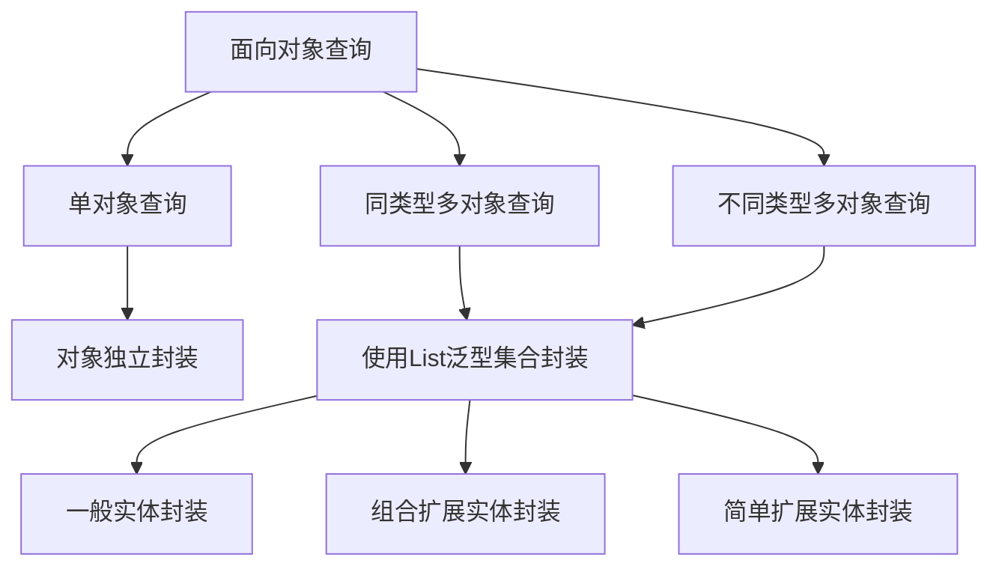

# ADO.NET数据访问技术

## 学习目标

1. 掌握C#访问数据库的基本方法
2. 掌握数据库查询的各种方法
3. 重点理解和掌握OOP原则在数据访问中的应用

## ADO.NET组件与数据库连接

### 理解ADO.NET

- ActiveX Data Objects（ADO）
- 是.NET平台下应用程序和数据源进行交互的一组面向对象类库
- 简单理解即：数据访问组件

### 主要组件

‎用于访问和操作数据的 ADO.NET 的两个主要组件是 .NET Framework 数据提供程序和‎[‎DataSet‎](https://docs.microsoft.com/en-us/dotnet/api/system.data.dataset)‎。‎

###   .NET Framework 数据提供程序类型

- .NET Framework数据提供程序
  - SQL Server数据库->System.Data.SqlClient命名空间
  - Access、Excel或SQLServer数据源->System.Data.OleDb命名空间
  - Oracle数据库->System.Data.OracleClient命名空间（需要添加引用）
  - ODBC公开数据库->System.Data.Odbc命名空间
- 第三方提供的数据提供程序：Mysql.NET数据提供程序

### 连接数据库的准备

- SQL Server服务器端口查看与修改

  启用TCP/IP


修改端口号


重启服务后生效

### 如何正确连接数据库

- 需要四个条件
  - 服务器IP地址
  - 数据库名称
  - 登录账号
  - 登录密码
- 账号的使用
  - sa账号拥有访问数据库的所有权限，学习和开发测试阶段使用

### Connection对象

- 作用：建立应用程序和数据库的点对点连接

- 属性：ConnectionString(连接字符串)

  - 封装连接数据库的四个条件

  - Server=服务器名称或IP地址;DataBase=数据库名称;User ID=登录账户;Password=登录密码

  - 使用SQLServer用户验证登录的字符串示例

    ```bash
    Server=192.168.1.2;DataBase=StudentManageDB;Uid=xiaoming;Pwd=password
    ```

  - 使用Windows集成验证登录的字符串示例（仅限于本机）

    ```bash
    Data Source=; Initial Catalog=StudentManageDB;Integrated Security=True
    ```

- 方法：

  - Open()：打开连接
  - Close()：关闭连接

## 数据库增、删、改方法的编写

### Command对象

- 作用：向数据库发送SQL语句
  - 封装“连接对象”和要执行的“SQL语句”
  - 对数据库执行具体的操作，提供“增、删、改、查”的方法
- 属性
  - CommandText：需要封装的SQL语句或存储过程名称
  - Connection：Command对象使用的数据库连接对象
- 方法：
  - ExecuteNonQuery()：执行增、删、改操作
  - ExecuteScalar()：返回单一结果查询
  - ExecuteReader()：返回只读数据列表的查询
- ExecuteNonQuery()方法使用要点
  - 执行insert、update、delete类型的语句
  - 执行后返回受影响的行数，一般是大于0的整数，等于0说明没有影响，-1表示执行出错

```c#
using System;
// 引入命名空间
using System.Data;
using System.Data.SqlClient;


namespace ADOConnectSql
{
    internal class Program
    {
        static void Main(string[] args)
        {
            // 定义连接字符串
            // string connStrings = "Server=.;Database=StudentsManageDB;UID=sa;PWD=sqlpassword";
            string connStrings = "Data Source=; Initial Catalog=StudentManageDB;Integrated Security=True";

            // 创建连接对象
            SqlConnection sqlConnection = new SqlConnection(connStrings);
            // 打开连接
            try
            {
                sqlConnection.Open();
                if (ConnectionState.Open == sqlConnection.State)
                {
                    // Console.WriteLine("Connection is opened");
                    // 连接成功，执行SQL语句
                    string sqlString = @"insert into Students(StudentName,Gender,Birthday,StudentIdNo,Age,PhoneNumber,StudentAddress,ClassId)";
                    sqlString += "values('{0}','{1}','{2}','{3}','{4}','{5}','{6}','{7}')";
                    sqlString = string.Format(sqlString, "张三", "男", "1990-09-01", 413302198730289090, 20, "12972782727", "北京", 1);
                    // 创建Command对象
                    /*SqlCommand sqlCommand = new SqlCommand();
                    sqlCommand.CommandText = sqlString;*/
                    SqlCommand sqlCommand = new SqlCommand(sqlString, sqlConnection);

                    int result = sqlCommand.ExecuteNonQuery();

                    Console.WriteLine(result);
                }
                else
                {
                    Console.WriteLine("Connection is filed");
                }
            }
            catch (Exception ex)
            {

                Console.WriteLine(ex.Message);
            }
            
            // 关闭连接
            sqlConnection.Close();
            if (ConnectionState.Closed == sqlConnection.State)
            {
                Console.WriteLine("Connection is Closed");
            }
            Console.ReadLine();
        }
    }
}
```

修改实体

```c#
// 修改实体
string updateString = @"update Students set StudentName='{0}' where StudentId={1}";
updateString = string.Format(updateString,"钱七", 100005);
result = new SqlCommand(updateString, sqlConnection).ExecuteNonQuery();
```

### 获得标识列的值

- 问题引出

  - 在Students表中添加一个新的学员对象，并返回新增学员的学号
  - 提示：学号是自动标识的，即插入新纪录以后返回该记录的标识列

- 问题解决：

  - 在insert语句后面添加select @@identity查询

  - 执行ExecuteScalar()方法：同时执行insert和select

    ```sql
    insert insert into Students(StudentName,Gender,Birthday,StudentIdNo,Age,PhoneNumber,StudentAddress,ClassId)
    values('张三','男','1990-01-20',123302198730289090,24,'010-1231231','深圳海上世界',1);select @@identity
    ```

  - 说明

    - @@identity是数据库中的一个全局变量，里面保存着最近一次生成的标识列的值

  ```csharp
  string sqlString = @"insert into Students(StudentName,Gender,Birthday,StudentIdNo,Age,PhoneNumber,StudentAddress,ClassId)";
  sqlString += "values('{0}','{1}','{2}','{3}','{4}','{5}','{6}','{7}');select @@identity";
  sqlString = string.Format(sqlString, "赵四", "男", "1990-09-01", 012307998730289090, 20, "13972782727", "北京", 1);
  SqlCommand sqlCommand = new SqlCommand(sqlString, sqlConnection);
  object res = sqlCommand.ExecuteScalar();
  
  Console.WriteLine(res);
  ```

## 数据查询方法

### 返回单一结果查询

- 问题：如何执行如下查询？
  - 1. 查询全部的学生总数
    2. 查询学号等于100004的学员姓名

- 使用ExecuteScalar()方法

  - 单一结果：单行单列
  - 返回object类型

- 代码编写分析：查询学员总数

  ```csharp
  // 创建sql语句
  string sql = "select count(*) from Students";
  // 创建Command对象,查询
  object result = new SqlCommand(sql, sqlConnection).ExecuteScalar();
  Console.WriteLine(result);
  ```


#### 单一结果查询步骤总结

1. 创建Connection对象
2. 组合SQL语句：select单一结果查询
3. 创建Command对象，并封装Connection和SQL语句
4. 打开连接
5. 执行ExecuteScalar()方法，返回单一结果（object类型）
6. 关闭连接

### 返回只读数据集的查询

- 使用ExecuteReader()方法基本步骤
  1. 创建Connection对象
  2. 组合Select类型的SQL语句
  3. 组建Command对象，并封装Connection和SQL语句
  4. 打开连接
  5. 执行ExecuteReader()方法，返回DataReader对象
  6. 逐行读取查询结果
  7. 关闭读取器
  8. 关闭连接

- DataReader对象读取数据的原理
- 特别注意
  - DataReader对象采取循环的方式检查并读取数据
  - 在没有读取完毕之前，数据库的连接将始终处于打开状态
  - 关闭连接前，必需要关闭读取器，且两者都必需关闭

```csharp
string sql = "select StudentId,StudentName from Students;select ClassId,ClassName from StudentClass;";
SqlDataReader result = new SqlCommand(sql, sqlConnection).ExecuteReader();
// 读取第一个结果集
while (result.Read())
{
    Console.WriteLine(result["StudentId"].ToString()+ result["StudentName"].ToString());
}
Console.WriteLine("---------------------------");
// 判断是否下一个结果集
if (result.NextResult())
{
    while (result.Read())
    {
        Console.WriteLine(result["ClassId"].ToString() + result["ClassName"].ToString());

    }
}
```

## 基于OOP原则优化数据库访问

### 实现代码复用

- 代码复用的基本形式：编写一个通用的方法
- 代码复用技术应用要求
  - 原则：提取不变的，封装变化的
  - 技巧：不变的作为“方法体”，变化的作为参数

### 实体类在开发中的应用

#### 方法参数的问题与解决

- 方法参数多的缺点
  - 定义和使用不方便，很容易把参数写错
  - 当对象的属性发生变化时，方法的参数必需改变
  - 参数的改变，造成对象接口不稳定，降低可维护性、可扩展性和安全性
  - 方法参数多，不符合面向对象中“低耦合、高内聚”的要求
  - 后台方法的编写依赖数据库的完成
  - 前台代码实现依赖后台方法的完成
- 问题解决思路
  - 为类的设计提供一个规范，稳定对象的接口
  - 不同开发人员只需要按照规范接口即可同步开发
- 问题解决办法
  - 使用“实体类”作为方法参数，稳定对外接口

####  实体类的设计

- 概念与形式

  - 只包含属性和构造方法的类称为实体类
  - 实体属性和数据库实体属性一一对应（字段名称和数据类型一致）

  | 实体类属性类型 | 数据库数据类型              |
  | -------------- | --------------------------- |
  | string         | char,nchar,varchar,nvarchar |
  | int            | int,smallint                |
  | Date Time      | datetime, smalldatetime     |
  | float          | float                       |
  | bool           | byte                        |
  | decimal        | decimal,money               |

   ```csharp
   namespace ADOConnectSql.Models
   {
       /// <summary>
       /// 学生实体类
       /// </summary>
       class Student
       {
           public int StudentId { get; set; }
           public string StudentName { get; set; }
           public string Gender { get; set; }
           public DateTime Birthday { get; set; }
           public decimal StudentIdNo { get; set; }
           public string PhoneNumber { get; set; }
           public int ClassId { get; set; }
       }
   }
   
   ```
  

# 数据查询与对象封装

## 封装和解析对象的意义

- 稳定数据访问接口，明确职责
- 前台开发人员和后台开发人员可以分离并实现同步开发
  - 数据访问方法只关心如何封装对象，而不关心谁使用
  - 界面数据展示部分只关心如何解析对象，而不关心如何查询并封装对象
  - 前台和后台各自职责完全分离，充分体现面向对象开发色思想（高内聚，低耦合）

## 多个同类型对象的封装

```csharp
public static List<Student> GetAllStudents()
{
    string sqlString = "select StudentName,Gender,Birthday,StudentIdNo,Age,PhoneNumber,StudentAddress,ClassId from Students";
    // 执行查询
    SqlDataReader objReader = SQLHelper.GetReaderResult(sqlString);
    List<Student> stuList = new List<Student>();
    while (objReader.Read())
    {
        // 将对象添加到集合
        stuList.Add(new Student(){
            StudentName = objReader["StudentName"].ToString(),
            Gender = objReader["Gender"].ToString(),
            Birthday = Convert.ToDateTime(objReader["Birthday"]),
            StudentIdNo = Convert.ToDecimal(objReader["StudentIdNo"]),
            Age = Convert.ToInt16(objReader["Age"]),
            PhoneNumber = objReader["PhoneNumber"].ToString(),
            StudentAddress = objReader["StudentAddress"].ToString(),
        });
    }
    // 关闭读取器
    objReader.Close();
    // 返回对象集合
    return stuList;
}
```

#### 调用数据访问方法

```csharp
// 调用数据访问方法获取学员对象
List<Student> listStudent= StudentService.GetAllStudents();
if (listStudent.Count != 0)
{
    Console.WriteLine("姓名" + "\t" + "班级" + "\t" + "年龄" + "\t" + "生日" + "\t" + "电话");
    foreach (Student item in listStudent) // 解析对象
    {
        Console.WriteLine(item.StudentName + "\t" + item.ClassId + "\t" + item.Age + "\t" + item.Birthday.ToShortDateString() + "\t" + item.PhoneNumber);
    }
}
else
{
    Console.WriteLine("没有要显示的数据！");
}
```

### 组合扩展实体的应用

```csharp
namespace ADOConnectSql
{
    /// <summary>
    /// 组合扩展实体
    /// </summary>
    public class StudentExt
    {
        public StudentExt()
        {
            objStudent = new Student();
            objScore = new ScoreList();
            objClass = new StudentClass();
        }
        public Student objStudent { get; set; }
        public StudentClass objClass { get; set; }
        public ScoreList objScore { get; set; }
    }
}	
```

## 面向对象查询总结




